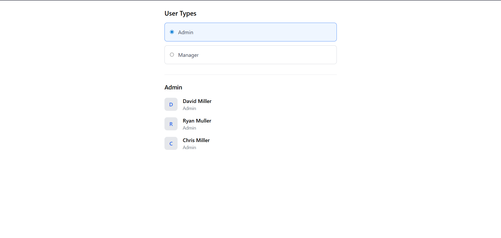

Zeller Customers project is react + typeScript based application where customer data is fetch from an AWS AppSync GraphQL API and displays customers based on their user role .

<!-- Approach & Setup -->
1. UI Layer

The UI is composed of a single reusable component, CustomerUI, responsible for:
- Displaying user types (Admin / Manager)
- Allowing the user to switch roles
- Showing filtered customer lists

2. Data Layer
The useCustomers custom hook manages:
- GraphQL API retrieval
- Normalizing data (lower-casing roles to keep matching consistent)

3. API Layer
The graphqlClient handles all communication with AWS AppSync.
It is responsible for:
- Configuring Amplify at startup
- Creating a GraphQL client with authMode: "apiKey"
- Executing queries

<!-- Setup & Installation -->
Step 1 - npm install 

Step 2 — Add environment variables - Create a .env
 - VITE_APPSYNC_API_KEY=appsync-api-key
  VITE_APPSYNC_ENDPOINT=https://prrwjjssnvhpbcdwbcwx3nm3zm.appsync-api.ap-southeast-2.amazonaws.com/graphql
  VITE_APPSYNC_REGION=ap-southeast-2

Step 3 — Configure AWS Amplify -
export default {
  aws_appsync_graphqlEndpoint: import.meta.env.VITE_APPSYNC_ENDPOINT,
  aws_appsync_region: import.meta.env.VITE_APPSYNC_REGION,
  aws_appsync_authenticationType: "API_KEY",
  aws_appsync_apiKey: import.meta.env.VITE_APPSYNC_API_KEY,
};

Step 4 — Run the project - npm run dev

 <!-- UI  screenshot-->

